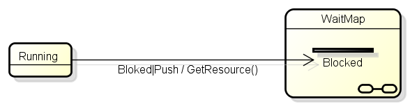
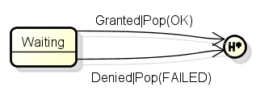
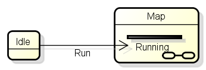

# Astah2Smc-Plugin

このプラグインは、実行したAstahファイルに含まれるクラスに内包されているステート図から[SMC](http://smc.sourceforge.net/)でコンパイルできる形式のコードを生成します。

## 使い方

## 記述方法

### ステートチャートの配置

*   親となるパッケージ、サブシステムもしくはクラス毎に.smファイルを作成します。
*   同じクラス内に複数のステートチャートが存在することが可能ですが、同じ.smファイルに配置されるステートチャートは、開始疑似状態を一つだけ持つものとします。

### ステートチャートの記述

ほぼ、通常の状態遷移機械の記述を行えばよいですが、一部特殊な表記によって実現している機能があります。

#### 複数行に渡るActionの記述

Astahでは複数行のActionを記述することができないため、「;」で区切って記述することで対応します。

#### Push

    	Running
    	{ 
    		Blocked push(WaitMap::Blocked) {GetResource();}
    	}

下図のように、イベントに「|push」を付加した上で、遷移先の状態をサブマシン内のスタブ状態として記述します。

#### Pop

    	Waiting
    	{
    		Granted pop(OK) {cleanUp();}
    		Denied pop(FAILED) {cleanUp();}
    	}

下図のように、イベントに「|pop(復帰先に発行するイベント)」を付加し、「深い履歴状態」へ遷移する形で記述します。

#### Jump

    	Idle
    	{
    		Run jump(Running) {}
    	}

下図のように、サブマシン内のスタブ状態への遷移として記述します。現在のMap内への遷移であっても、ステート図の名前と同じ名前のサブマシンを配置して、その内部への遷移として表現します。

#### 未対応項目
以下の図要素はステートマシン図内に記述してあっても無視されます。

*   サブ状態
*   浅い履歴状態
*   ジャンクション
*   選択

# CLI(Command Line Interface)

## コンパイル

### 前準備

コンパイル及びテストを実施するために、ローカルレポジトリにastah関連のjarファイルを登録する必要があります。

#### OSX(Astah Community)の場合
    $ mvn install:install-file -Dfile=/Applications/astah\ community/astah\ community.app/Contents/Java/astah-api.jar -DgroupId=astah_api -DartifactId=astah_api -Dversion=6.7 -Dpackaging=jar -DgeneratePom=true
    $ mvn install:install-file -Dfile=/Applications/astah\ community/astah\ community.app/Contents/Java/astah-community.jar -DgroupId=astah_product -DartifactId=astah_product -Dversion=6.7 -Dpackaging=jar -DgeneratePom=true

#### Windows(Astah UML)の場合
    $ mvn install:install-file -Dfile='C:\Program Files\astah-UML\astah-api.jar' -DgroupId=astah_api -DartifactId=astah_api -Dversion=6.7 -Dpackaging=jar -DgeneratePom=true
    $ mvn install:install-file -Dfile='C:\Program Files\astah-UML\astah-uml.jar' -DgroupId=astah_product -DartifactId=astah_product -Dversion=6.7 -Dpackaging=jar -DgeneratePom=true

### コンパイル

CLIディレクトリにて

    $ mvn compile

でコンパイルできます。

