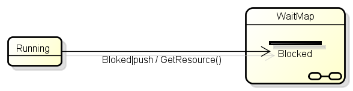
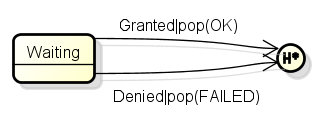
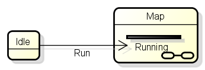

# 使い方

## Astahのプラグイン

「ツール」→「Astah2Smc」→「SMCファイル生成」で、ディレクトリ選択ダイアログが開きます。
ディレクトリを指定すると、そのディレクトリ以下に
パッケージもしくはクラスをディレクトリとし、同一階層にあるステートマシン図を一つの.smファイルにまとめて生成します。
上書き確認は実施しません。

## コマンドラインツール

astar-api.jarとastar-commumity.jarの再配布が禁止されているため、コマンドラインツールを利用するためには
コマンドラインツールを実行するマシンにAstahがインストールされている必要があります。

基本的に、コマンドラインツールは動作確認用とし、jarファイルの配布等は行いません。

## 記述方法

### ステートチャートの配置

*   親となるパッケージ、サブシステムもしくはクラス毎に.smファイルを作成します。
*   同じクラス内に複数のステートチャートが存在することが可能ですが、同じ.smファイルに配置されるステートチャートは、開始疑似状態を一つだけ持つものとします。

### ステートチャートの記述

ほぼ、通常の状態遷移機械の記述を行えばよいですが、一部特殊な表記によって実現している機能があります。

#### 複数行に渡るActionの記述

Astahでは複数行のActionを記述することができないため、「;」で区切って記述することで対応します。

#### Push

    	Running
    	{ 
    		Blocked push(WaitMap::Blocked) {GetResource();}
    	}

下図のように、イベントに「|push」を付加した上で、遷移先の状態をサブマシン内のスタブ状態として記述します。

#### Pop

    	Waiting
    	{
    		Granted pop(OK) {cleanUp();}
    		Denied pop(FAILED) {cleanUp();}
    	}

下図のように、イベントに「|pop(復帰先に発行するイベント)」を付加し、「深い履歴状態」へ遷移する形で記述します。

#### Jump

    	Idle
    	{
    		Run jump(Running) {}
    	}

下図のように、サブマシン内のスタブ状態への遷移として記述します。現在のMap内への遷移であっても、ステート図の名前と同じ名前のサブマシンを配置して、その内部への遷移として表現します。

#### 特殊な記述

##### 開始疑似状態

クラス内に複数のステートマシン図を配置した場合、それらは一つのsmファイルにまとめられます。
開始疑似状態はそれらのうち一つのみに記述して下さい。

複数記述した場合には、エラーにはなりませんが、変換時に最後に発見した開始疑似状態を利用する実装になっているため、
どの開始疑似状態を用いるのか保証できなくなります。

##### 「%header」ディレクティブ

ステートマシン図の「定義」に

    header : [ヘッダ名]
	
と書いておくと、%headerディレクティブに追加されます。
「:」の前後はスペースのみ許されます。タブはダメです。

#### 未対応項目
以下の図要素はステートマシン図内に記述してあっても無視されます。

*   サブ状態
*   浅い履歴状態
*   ジャンクション
*   選択
